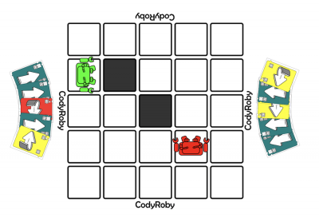
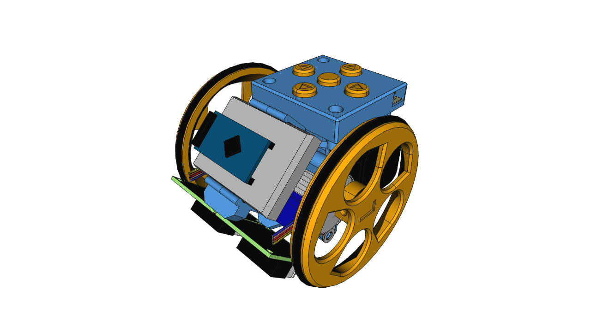
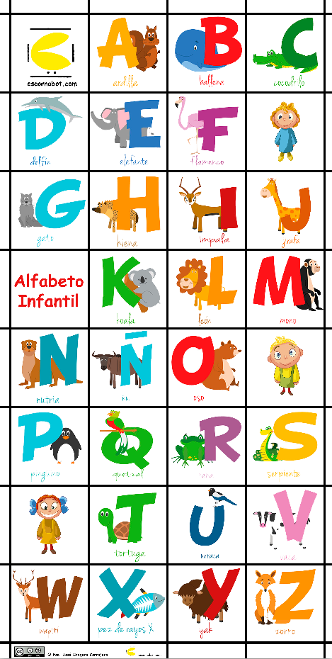
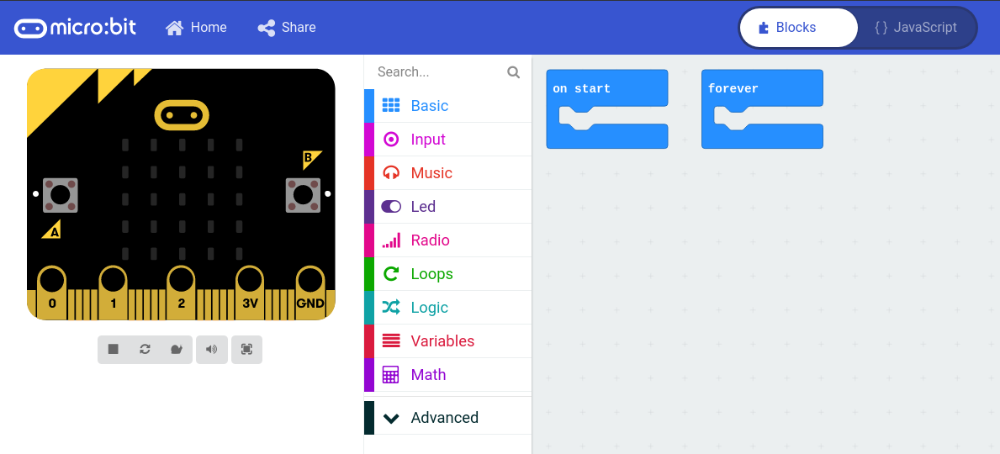
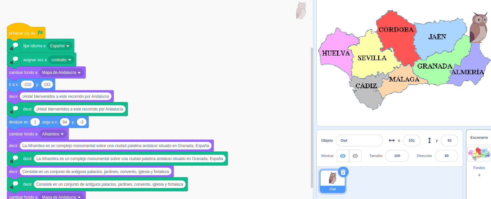

#  Introducción a la robóticaen educaciónInfantil y Primaria:

Licencia CC by SA @javacasm

## Objetivos
- Facilitar la alfabetización digital para el aprendizaje de competencias.
- Introducción al pensamiento computacional en el entorno de juegos
- Desarrollar estrategias de resolución de problemas
- Aprender a programar mediante bloques
- Uso de herramientas computacionales como elemento transversal

## Contenidos
* El pensamiento computacional y los juegos
* Robótica en educación infantil: escornabot
* Qué es Scratch: usos educativos
* Programando con bloques: Scratch
* Placa Makey-Makey y su uso con Scratch
* Robótica con micro:bit

## Niveles y herramientas

Ed. Infantil: 
* Uso de escornabot con tapetes adecuados
* Uso de proyectos con makey-makey y scratch
* Juegos de pensamiento computacional desconectado

Ed. Primaria - 1er ciclo
* Uso de escornabot
* Programación con Scratch Jr
* Uso de makey-makey
* Juegos de pensamiento computacional desconectado

Ed. Primaria - 2º ciclo
* Uso y montaje de makey-makey 
* Programación con Scratch
* Juegos de pensamiento computacional desconectado

Ed. Primaria - 3er ciclo
* Programación de micro:bit
* Montaje de makey-makey
* Programación de scratch 
* Montaje de Escornabot
* Juegos de pensamiento computacional desconectado

## Herramientas

Pensamiento computacional desconectado

Escornabot

Tapetes para escornabot

micro:bit

Scratch

Scratch Jr.

